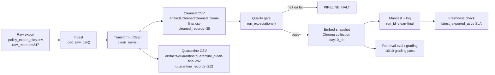

# Kiến trúc pipeline — Lab Day 10

**Họ và tên:** Nguyễn Quang Minh - 2A202600816
**Cập nhật:** 2026-06-10

---

## 1. Sơ đồ luồng (bắt buộc có 1 diagram: Mermaid / ASCII)



Pipeline đọc raw CSV từ `data/raw/policy_export_dirty.csv`, chuẩn hóa ngày, loại record không thuộc source hợp lệ, quarantine dữ liệu cũ/nhiễu/trùng, sau đó chạy expectation suite trước khi embed. Run cuối dùng để nộp là `run_id=clean-final`, ghi tại `artifacts/logs/run_clean-final.log` và `artifacts/manifests/manifest_clean-final.json`.

Kết quả run cuối:

| Chỉ số | Giá trị |
|--------|---------|
| `run_id` | `clean-final` |
| `raw_records` | 247 |
| `cleaned_records` | 35 |
| `quarantine_records` | 212 |
| Chroma collection | `day10_kb` |
| Grading | 10/10 câu pass |

---

## 2. Ranh giới trách nhiệm

| Thành phần | Input | Output | Owner nhóm |
|------------|-------|--------|--------------|
| Ingest | `data/raw/policy_export_dirty.csv` | list raw rows, log `raw_records=247` | 
| Transform | raw rows | cleaned rows + quarantine rows | 
| Quality | cleaned rows | expectation results, halt/pass decision | 
| Embed | cleaned CSV | Chroma collection `day10_kb`, upserted vectors |
| Monitor | manifest JSON | freshness status, SLA detail | 

Các source hợp lệ được publish vào vector store:

- `policy_refund_v4`
- `sla_p1_2026`
- `it_helpdesk_faq`
- `hr_leave_policy`
- `access_control_sop`

Các nhóm lỗi chính được đưa vào quarantine:

- `unknown_doc_id`
- `missing_effective_date`
- `stale_hr_policy_effective_date`
- `stale_hr_policy_text_marker`
- `missing_chunk_text`
- `low_confidence_chunk_text`
- `duplicate_chunk_text`
- `non_p1_sla_chunk`

---

## 3. Idempotency & rerun

Pipeline publish index theo kiểu snapshot. Mỗi cleaned row có `chunk_id` ổn định được tạo từ `doc_id`, `chunk_text` sau clean và thứ tự sequence. Khi embed, pipeline dùng `col.upsert(ids=ids, ...)`, nên rerun cùng dữ liệu không tạo duplicate vector.

Trước khi upsert, pipeline đọc các id đang có trong Chroma và xóa các id không còn xuất hiện trong cleaned run mới. Vì vậy sau khi chạy inject hoặc sửa cleaning rule, các vector cũ không còn hợp lệ sẽ bị prune. Log cuối có dòng:

```text
embed_prune_removed=1
embed_upsert count=35 collection=day10_kb
PIPELINE_OK
```

Điều này giúp tránh trường hợp retrieval vẫn lấy chunk stale như refund `14 ngày`, HR `10 ngày phép năm`, hoặc chunk SLA P2 lẫn trong corpus P1.

---

## 4. Liên hệ Day 09

Day 09 tập trung multi-agent và retrieval workflow; Day 10 bổ sung tầng dữ liệu trước retrieval. Pipeline này làm sạch export từ các policy/helpdesk source rồi publish vào Chroma collection `day10_kb`. Agent hoặc retriever có thể trỏ vào collection này để lấy corpus đã qua kiểm soát chất lượng thay vì đọc raw export trực tiếp.

Các câu hỏi grading mô phỏng cùng nghiệp vụ Day 08/09:

- refund window phải là `7 ngày làm việc`, không lấy bản stale `14 ngày`;
- SLA P1 phải có `15 phút`, `4 giờ`, escalation `10 phút`;
- HR 2026 phải trả `12 ngày phép năm`, không trả bản HR 2025 `10 ngày phép năm`;
- access control phải retrieve được `access_control_sop` cho Level 4 Admin Access.


---

## 5. Rủi ro đã biết

- `freshness_check=FAIL` vì `latest_exported_at=2026-04-11T00:00:00`, cũ hơn SLA 24 giờ so với thời điểm chạy ngày 2026-06-10. Đây là rủi ro freshness của snapshot mẫu, cần ghi rõ trong runbook.
- Eval tự kiểm `eval_clean_final_v2.csv` còn một câu `q_p1_update_frequency` có `top1_doc_expected=no`, dù `contains_expected=yes` và `hits_forbidden=no`. Grading chính thức vẫn 10/10 pass, nhưng production nên cải thiện chunking/ranking cho câu P1 update frequency.
- Cleaning rule hiện dùng một số marker nghiệp vụ cụ thể như `10 ngày phép năm`, `Nội dung không rõ ràng`, `Ticket P2`. Nếu source thực tế thay đổi wording, nên chuyển các marker này vào data contract hoặc config.
- Pipeline hiện chạy batch từ CSV; nếu chuyển sang API/CDC cần thêm checkpoint, retry/backoff và alert volume drift.
